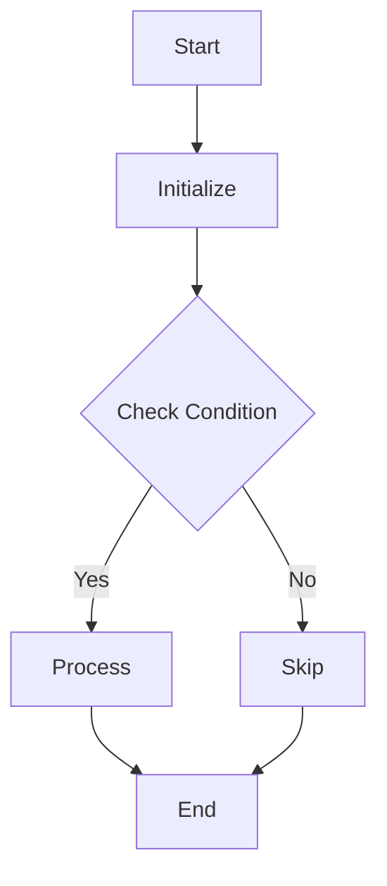
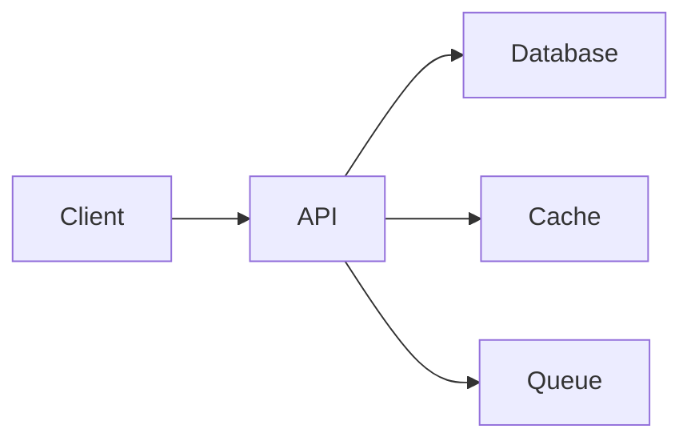

# GitPulse Demo Script

Welcome to the GitPulse demonstration! This guide will walk you through all the features of GitPulse, an AI-powered code quality tool that uses IBM Bob Shell to analyze your code changes.

## Table of Contents

1. [Quick Start](#quick-start)
2. [Section 1: Local CLI Demo](#section-1-local-cli-demo)
3. [Section 2: GitHub Action Demo](#section-2-github-action-demo)
4. [Section 3: Advanced Features](#section-3-advanced-features)
5. [Troubleshooting](#troubleshooting)

---

## Quick Start

**Want to try GitPulse right now?** Here's the fastest way:

```bash
# 1. Clone the repository
git clone https://github.com/your-org/gitpulse.git
cd gitpulse

# 2. Set your Bob API key
export BOB_API_KEY="your-api-key-here"

# 3. Navigate to the demo folder
cd demo

# 4. Make a change to trigger analysis
echo "// test change" >> src/UserService.js

# 5. Run GitPulse
node src/index.js check

# 6. View the results in your terminal and in gitpulse-reports/
```

That's it! Continue reading for a detailed walkthrough of all features.

---

## Section 1: Local CLI Demo

This section demonstrates how to use GitPulse as a command-line tool to analyze code changes locally.

### Prerequisites

Before starting, ensure you have:

1. **Node.js 18+** installed
   ```bash
   node --version  # Should be 18.0.0 or higher
   ```

2. **Bob Shell** installed and configured
   ```bash
   # Check if Bob is installed
   bob --version
   
   # If not installed, visit bob.ibm.com to download and install
   ```

3. **Bob API Key** set as an environment variable
   ```bash
   # Get your API key from bob.ibm.com/account
   export BOB_API_KEY="your-api-key-here"
   
   # Verify it's set
   echo $BOB_API_KEY
   ```

4. **GitPulse installed** (globally or via npx)
   ```bash
   # Option 1: Install globally
   npm install -g gitpulse
   
   # Option 2: Use npx (no installation needed)
   npx gitpulse --version
   ```

### Step 1: Navigate to the Demo Folder

The `demo/` folder contains a sample application with intentionally planted code issues for testing GitPulse.

```bash
cd demo
ls -la
```

**Expected output:**
```
demo/
├── package.json
├── README.md
└── src/
    └── UserService.js  # Contains planted issues
```

### Step 2: Examine the Demo Code

Let's look at what issues are planted in the demo code:

```bash
cat src/UserService.js
```

The `UserService.js` file contains several intentional issues:

- **Security Issue**: Hardcoded API key on line 8
- **Bug**: Null dereference on line 19 (no null check before accessing `user.password`)
- **Bug**: Null dereference on line 52 (accessing nested properties without null check)
- **SOLID Violation**: God class with multiple responsibilities (authentication, email, reports)
- **Performance Issue**: O(n²) nested loop in `findDuplicateEmails()` method (lines 68-74)
- **Missing Tests**: No unit tests for async `fetchUserData()` function

### Step 3: Make a Change to Trigger Analysis

GitPulse analyzes **changed files** in your git repository. Let's make a small change:

```bash
# Initialize git if not already done
git init

# Stage the file
git add src/UserService.js

# Make a small modification (or just touch the file)
echo "" >> src/UserService.js
```

### Step 4: Run GitPulse Check

Now run the main analysis command:

```bash
node ../src/index.js check
```

**Note:** Run from the `demo/` directory. The command uses `../src/index.js` to reference the GitPulse CLI from the parent directory.

**What happens:**
1. GitPulse detects changed files (UserService.js)
2. Runs 4 default checks: security-scan, solid-check, bug-detector, perf-analyzer
3. Displays color-coded results in the terminal
4. Generates JSON reports in `gitpulse-reports/`

### Step 5: Understanding the Terminal Output

The terminal output is color-coded by severity:

```
Found 1 changed file(s)

Running checks: security-scan, solid-check, bug-detector, perf-analyzer, test-generator

Running Security Scan on 1 file(s)...

Results from security-scan:

 CRITICAL 
 ! Hardcoded API Key (line 8)
  Evidence:
    this.API_KEY = 'sk-live-abc123xyz';
  Fix: Move sensitive credentials to environment variables or a secure vault

 HIGH 
⚠ Exposed Sensitive Data in Token (line 30)
  Evidence:
    return `${this.API_KEY}-${user.id}-${Date.now()}`;
  Fix: Use a proper JWT library and don't include API keys in tokens

Summary:
1 critical, 1 high findings

Running SOLID Principles Check on 1 file(s)...

Results from solid-check:

 HIGH 
⚠ Single Responsibility Principle Violation (line 5)
  Evidence:
    class UserService {
      // Handles authentication, email, reports, user management
    }
  Fix: Split into separate services: AuthService, EmailService, ReportService, UserRepository

 MEDIUM 
⚠ God Class Anti-pattern
  Evidence:
    UserService has 8 methods with mixed responsibilities
  Fix: Refactor into smaller, focused classes

Summary:
1 high, 1 medium findings

Running Bug Detector on 1 file(s)...

Results from bug-detector:

 HIGH 
⚠ Potential Null Dereference (line 19)
  Evidence:
    if (user.password === password) {
  Fix: Add null check: if (user && user.password === password)

 HIGH 
⚠ Potential Null Dereference (line 52)
  Evidence:
    name: user.profile.name,
  Fix: Add null checks: user?.profile?.name or validate user exists first

Summary:
2 high findings

Running Performance Analyzer on 1 file(s)...

Results from perf-analyzer:

 MEDIUM 
⚠ Inefficient Algorithm - O(n²) Complexity (line 68)
  Evidence:
    for (let i = 0; i < this.users.length; i++) {
      for (let j = i + 1; j < this.users.length; j++) {
  Fix: Use a Set or Map for O(n) complexity: const seen = new Set(); users.forEach(...)

Summary:
1 medium finding

Running Test Generator on 1 file(s)...

# Test Suite for UserService

## Suggested Unit Tests

### Test: authenticateUser
```javascript
describe('authenticateUser', () => {
  it('should return success for valid credentials', () => {
    // Test implementation
  });
  
  it('should handle null user gracefully', () => {
    // Test for null dereference bug
  });
});
```

### Test: findDuplicateEmails
```javascript
describe('findDuplicateEmails', () => {
  it('should find duplicate emails efficiently', () => {
    // Test implementation
  });
});
```

Reports written to gitpulse-reports/

✓ All checks complete
```

### Step 6: Examine the JSON Reports

GitPulse generates detailed JSON reports in the `gitpulse-reports/` directory:

```bash
ls -la gitpulse-reports/
```

**Expected output:**
```
gitpulse-reports/
├── security-scan.json
├── solid-check.json
├── bug-detector.json
├── perf-analyzer.json
└── summary.json
```

Let's look at a sample report:

```bash
cat gitpulse-reports/security-scan.json
```

**Example JSON output:**
```json
[
  {
    "severity": "Critical",
    "issue": "Hardcoded API Key",
    "line": 8,
    "file": "src/UserService.js",
    "evidence": "this.API_KEY = 'sk-live-abc123xyz';",
    "fix": "Move sensitive credentials to environment variables or a secure vault",
    "category": "security"
  },
  {
    "severity": "High",
    "issue": "Exposed Sensitive Data in Token",
    "line": 30,
    "file": "src/UserService.js",
    "evidence": "return `${this.API_KEY}-${user.id}-${Date.now()}`;",
    "fix": "Use a proper JWT library and don't include API keys in tokens",
    "category": "security"
  }
]
```

The `summary.json` file aggregates all findings:

```bash
cat gitpulse-reports/summary.json
```

**Example summary:**
```json
{
  "security-scan": {
    "timestamp": "2026-06-06T19:30:00.000Z",
    "findings": [...],
    "count": 2
  },
  "solid-check": {
    "timestamp": "2026-06-06T19:30:05.000Z",
    "findings": [...],
    "count": 2
  },
  "bug-detector": {
    "timestamp": "2026-06-06T19:30:10.000Z",
    "findings": [...],
    "count": 2
  },
  "perf-analyzer": {
    "timestamp": "2026-06-06T19:30:15.000Z",
    "findings": [...],
    "count": 1
  }
}
```

### What Each Check Found

Let's break down what each analysis check discovered in the demo code:

#### 1. **Security Scan** 🔒
- **Critical**: Hardcoded API key (`sk-live-abc123xyz`) on line 8
- **High**: API key exposed in authentication token on line 30
- **Impact**: Credentials could be leaked in version control or logs

#### 2. **SOLID Principles Check** 🏗️
- **High**: Single Responsibility Principle violation - UserService does too much
- **Medium**: God class anti-pattern with 8 methods handling different concerns
- **Impact**: Code is hard to maintain, test, and extend

#### 3. **Bug Detector** 🐛
- **High**: Null dereference on line 19 - accessing `user.password` without null check
- **High**: Null dereference on line 52 - accessing `user.profile.name` without validation
- **Impact**: Runtime crashes when user is not found

#### 4. **Performance Analyzer** ⚡
- **Medium**: O(n²) nested loop in `findDuplicateEmails()` on lines 68-74
- **Impact**: Performance degrades significantly with large user lists

#### 5. **Test Generator** 🧪
- Generated test suite suggestions for untested methods
- Identified `fetchUserData()` as needing async test coverage
- Provided test templates for bug-prone methods

---

## Section 2: GitHub Action Demo

This section shows how to set up GitPulse as a GitHub Action to automatically review pull requests.

### Step 1: Set Up the GitHub Action

Create a workflow file in your repository:

```bash
mkdir -p .github/workflows
```

Create `.github/workflows/gitpulse.yml`:

```yaml
name: GitPulse PR Review

on:
  pull_request:
    types: [opened, synchronize, reopened]

jobs:
  gitpulse-review:
    runs-on: ubuntu-latest
    name: Run GitPulse Code Review
    
    permissions:
      contents: read
      pull-requests: write
    
    steps:
      - name: Checkout code
        uses: actions/checkout@v4
        with:
          fetch-depth: 0  # Fetch all history for proper diff analysis
      
      - name: Run GitPulse Review
        uses: your-org/gitpulse-action@v1
        with:
          bob_api_key: ${{ secrets.BOB_API_KEY }}
          checks: 'security-scan,solid-check,bug-detector,perf-analyzer,test-generator'
          fail_on: 'critical'
        env:
          GITHUB_TOKEN: ${{ secrets.GITHUB_TOKEN }}
```

### Step 2: Configure Secrets

Add your Bob API key to GitHub Secrets:

1. Go to your repository on GitHub
2. Navigate to **Settings** → **Secrets and variables** → **Actions**
3. Click **New repository secret**
4. Name: `BOB_API_KEY`
5. Value: Your Bob API key from bob.ibm.com/account
6. Click **Add secret**

![Screenshot placeholder: GitHub Secrets configuration page]

### Step 3: Create a Sample Pull Request

Let's create a PR with the demo code to see GitPulse in action:

```bash
# Create a new branch
git checkout -b feature/add-user-service

# Add the demo file with issues
cp demo/src/UserService.js src/UserService.js
git add src/UserService.js

# Commit and push
git commit -m "Add UserService with authentication logic"
git push origin feature/add-user-service
```

### Step 4: Open the Pull Request

1. Go to your repository on GitHub
2. Click **Pull requests** → **New pull request**
3. Select your branch: `feature/add-user-service`
4. Click **Create pull request**
5. Add a title and description
6. Click **Create pull request**

![Screenshot placeholder: GitHub PR creation page]

### Step 5: Watch the GitHub Action Run

Once the PR is created, GitPulse automatically starts:

1. Navigate to the **Actions** tab in your repository
2. Click on the latest workflow run: "GitPulse PR Review"
3. Watch the real-time logs as GitPulse analyzes your code

![Screenshot placeholder: GitHub Actions workflow running]

**Expected workflow steps:**
```
✓ Checkout code
✓ Run GitPulse Review
  ├─ Setting up Bob Shell
  ├─ Running security-scan... (2 findings)
  ├─ Running solid-check... (2 findings)
  ├─ Running bug-detector... (2 findings)
  ├─ Running perf-analyzer... (1 finding)
  ├─ Running test-generator... (suggestions generated)
  └─ Posting review comment to PR
```

### Step 6: View the Automated PR Comment

GitPulse posts a comprehensive review comment on your PR:

![Screenshot placeholder: GitPulse PR comment]

**Example PR Comment:**

---

## 🛡️ GitPulse Review

**Found 7 issue(s):** 🔴 1 Critical • 🟠 3 High • 🟡 2 Medium

| Severity | Check | Issue | Line | Fix |
|----------|-------|-------|------|-----|
| 🔴 Critical | security-scan | Hardcoded API Key | 8 | Move sensitive credentials to environment variables or a secure vault |
| 🟠 High | security-scan | Exposed Sensitive Data in Token | 30 | Use a proper JWT library and don't include API keys in tokens |
| 🟠 High | solid-check | Single Responsibility Principle Violation | 5 | Split into separate services: AuthService, EmailService, ReportService |
| 🟠 High | bug-detector | Potential Null Dereference | 19 | Add null check: if (user && user.password === password) |
| 🟠 High | bug-detector | Potential Null Dereference | 52 | Add null checks: user?.profile?.name or validate user exists first |
| 🟡 Medium | solid-check | God Class Anti-pattern | - | Refactor into smaller, focused classes |
| 🟡 Medium | perf-analyzer | Inefficient Algorithm - O(n²) Complexity | 68 | Use a Set or Map for O(n) complexity |

---

*Powered by [GitPulse](https://github.com/your-org/gitpulse) with IBM Bob Shell*

---

### Step 7: Understanding the Action Behavior

The GitHub Action has several configurable behaviors:

#### **fail_on Parameter**

Controls when the action should fail the CI check:

```yaml
fail_on: 'critical'  # Fails only on Critical findings (default)
fail_on: 'high'      # Fails on High or Critical findings
fail_on: 'medium'    # Fails on Medium, High, or Critical findings
fail_on: 'low'       # Fails on any findings
```

**Example scenarios:**

- **fail_on: 'critical'** → PR with hardcoded API key → ❌ Check fails
- **fail_on: 'high'** → PR with null dereference bug → ❌ Check fails
- **fail_on: 'medium'** → PR with performance issue → ❌ Check fails
- **fail_on: 'low'** → PR with any code smell → ❌ Check fails

#### **checks Parameter**

Customize which checks to run:

```yaml
# Run only security and bug checks
checks: 'security-scan,bug-detector'

# Run all available checks
checks: 'security-scan,solid-check,bug-detector,perf-analyzer,test-generator'

# Run only SOLID and performance checks
checks: 'solid-check,perf-analyzer'
```

### Step 8: Review and Merge

After reviewing the GitPulse findings:

1. **Fix the issues** identified in the PR comment
2. **Push the fixes** to the same branch
3. GitPulse automatically re-runs on the updated code
4. Once all critical issues are resolved, **merge the PR**

---

## Section 3: Advanced Features

This section covers advanced GitPulse features and commands.

### Feature 1: Running Specific Checks

Use the `--only` flag to run specific checks instead of all defaults:

```bash
# Run only security scan
node ../src/index.js check --only security-scan

# Run security and bug detection
node ../src/index.js check --only security-scan,bug-detector

# Run only SOLID principles check
node ../src/index.js check --only solid-check
```

**Available checks:**
- `security-scan` - Security vulnerabilities and unsafe patterns
- `solid-check` - SOLID principles adherence
- `bug-detector` - Potential bugs and code issues
- `perf-analyzer` - Performance optimizations
- `test-generator` - Unit test suggestions
- `readme-writer` - README documentation
- `flowchart` - Code logic flowcharts
- `architecture-diagram` - System architecture diagrams
- `onboarding-guide` - Developer onboarding docs
- `code-converter` - Code language conversion

**Example output:**
```bash
$ node ../src/index.js check --only security-scan

Found 1 changed file(s)

Running checks: security-scan

Running Security Scan on 1 file(s)...

Results from security-scan:
[... security findings only ...]

✓ All checks complete
```

### Feature 2: CI Mode for Branch Comparisons

Use `--ci` mode to compare your current branch against the main branch:

```bash
# Compare current branch with origin/main
node ../src/index.js check --ci
```

**What CI mode does:**
1. Runs `git diff origin/main...HEAD` to find changed files
2. Analyzes only the files that differ from main
3. Exits with code 1 if Critical findings are detected
4. Perfect for CI/CD pipelines

**Example in CI pipeline:**
```yaml
# .github/workflows/ci.yml
- name: Run GitPulse
  run: |
    node src/index.js check --ci
  # This step will fail if Critical issues are found
```

**Local usage:**
```bash
# Create a feature branch
git checkout -b feature/new-feature

# Make changes
echo "const apiKey = 'hardcoded';" > src/config.js
git add src/config.js

# Run CI mode check
gitpulse check --ci

# Output:
# Found 1 changed file(s)
# Running checks: security-scan, solid-check, bug-detector, perf-analyzer, test-generator
# ...
# ❌ Critical findings detected. Exiting with code 1.
# Exit code: 1
```

### Feature 3: Different Output Formats

Control how GitPulse displays results:

```bash
# Terminal output only (default, color-coded)
node ../src/index.js check --output terminal

# JSON files only (no terminal output)
node ../src/index.js check --output json

# Both terminal and JSON files
node ../src/index.js check --output both
```

**Use cases:**

- **terminal**: Quick feedback during development
- **json**: Integrate with other tools, CI/CD dashboards
- **both**: Full visibility and machine-readable reports

**Example with JSON output:**
```bash
$ node ../src/index.js check --output json

Found 1 changed file(s)
Running checks: security-scan, solid-check, bug-detector, perf-analyzer, test-generator
Reports written to gitpulse-reports/
✓ All checks complete

$ ls gitpulse-reports/
security-scan.json  solid-check.json  bug-detector.json  perf-analyzer.json  summary.json
```

### Feature 4: Generate Documentation

Use `node ../src/index.js docs` to generate comprehensive project documentation:

```bash
node ../src/index.js docs
```

**What it generates:**

1. **README** - Project overview, installation, usage
2. **Flowchart** - Code logic visualization
3. **Architecture Diagram** - System architecture overview

**Example output:**
```bash
$ node ../src/index.js docs

Generating project documentation...

Generating README...

# Project Name

## Overview
[AI-generated project description based on code analysis]

## Installation
```bash
npm install
```

## Usage
[AI-generated usage instructions]

## Features
- Feature 1
- Feature 2

Generating flowchart...



Generating architecture diagram...



✓ Documentation generation complete
```

### Feature 5: Generate Onboarding Guide

Use `node ../src/index.js onboard` to create developer onboarding documentation:

```bash
node ../src/index.js onboard
```

**What it generates:**

- Project setup instructions
- Development workflow
- Code structure overview
- Key concepts and patterns
- Testing guidelines
- Contribution guidelines

**Example output:**
```bash
$ node ../src/index.js onboard

Generating onboarding guide...

# Developer Onboarding Guide

## Welcome to the Project! 👋

### Prerequisites
- Node.js 18+
- Git
- [Other requirements based on code analysis]

### Getting Started

1. **Clone the repository**
   ```bash
   git clone https://github.com/your-org/project.git
   cd project
   ```

2. **Install dependencies**
   ```bash
   npm install
   ```

3. **Run the development server**
   ```bash
   npm run dev
   ```

### Project Structure
```
src/
├── index.js       # Main entry point
├── services/      # Business logic
├── utils/         # Helper functions
└── tests/         # Test files
```

### Development Workflow
1. Create a feature branch
2. Make your changes
3. Run tests: `npm test`
4. Submit a pull request

### Key Concepts
[AI-generated explanation of main patterns and concepts]

### Testing
[AI-generated testing guidelines based on existing tests]

✓ Onboarding guide generated
```

### Feature 6: Convert Code Between Languages

Use `node ../src/index.js convert` to translate code to another language:

```bash
# Convert JavaScript to Python
node ../src/index.js convert src/UserService.js --to python

# Convert Python to TypeScript
node ../src/index.js convert app.py --to typescript

# Convert Java to Go
node ../src/index.js convert Main.java --to go
```

**Supported languages:**
- JavaScript/TypeScript
- Python
- Java
- Go
- Rust
- C/C++
- Ruby
- PHP
- C#
- Swift
- Kotlin

**Example output:**
```bash
$ node ../src/index.js convert src/UserService.js --to python

Converting src/UserService.js to python...

# Converted Python Code

```python
class UserService:
    """
    UserService - Handles all user-related operations
    """
    
    def __init__(self):
        # Security Issue: Hardcoded API key
        self.API_KEY = 'sk-live-abc123xyz'
        self.users = []
    
    def authenticate_user(self, username, password):
        """Authenticate user"""
        user = next((u for u in self.users if u['username'] == username), None)
        
        # Bug: Null dereference - no null check before accessing properties
        if user['password'] == password:
            return {
                'success': True,
                'token': self.generate_token(user)
            }
        
        return {'success': False}
    
    def generate_token(self, user):
        """Generate authentication token"""
        import time
        return f"{self.API_KEY}-{user['id']}-{int(time.time() * 1000)}"
    
    # ... rest of the converted code
```

✓ Converted code saved to gitpulse-reports/converted-UserService.js
```

### Feature 7: Combining Multiple Options

You can combine multiple flags for powerful workflows:

```bash
# CI mode with specific checks and JSON output
node ../src/index.js check --ci --only security-scan,bug-detector --output json

# Run all checks with both terminal and JSON output
node ../src/index.js check --output both

# CI mode with all checks
node ../src/index.js check --ci --output both
```

**Example: Security-focused CI pipeline**
```bash
# Only run security and bug checks in CI
node ../src/index.js check --ci --only security-scan,bug-detector --output json

# Parse the JSON and fail if any findings
if [ -f gitpulse-reports/security-scan.json ]; then
  findings=$(cat gitpulse-reports/security-scan.json | jq 'length')
  if [ "$findings" -gt 0 ]; then
    echo "Security issues found!"
    exit 1
  fi
fi
```

---

## Troubleshooting

### Common Issues and Solutions

#### Issue 1: "Bob Shell is not installed or not on PATH"

**Error message:**
```
❌ Bob Shell is not installed or not on PATH.
Install it from bob.ibm.com and ensure it's in your PATH.
```

**Solution:**
1. Download Bob Shell from [bob.ibm.com](https://bob.ibm.com)
2. Install it following the platform-specific instructions
3. Verify installation:
   ```bash
   bob --version
   ```
4. If still not found, add Bob to your PATH:
   ```bash
   # macOS/Linux
   export PATH="/path/to/bob:$PATH"
   
   # Windows
   set PATH=%PATH%;C:\path\to\bob
   ```

#### Issue 2: "Not a git repository"

**Error message:**
```
❌ Not a git repository. Please run this command from within a git repository.
```

**Solution:**
```bash
# Initialize git in your project
git init

# Or navigate to an existing git repository
cd /path/to/your/git/repo
```

#### Issue 3: "No changed files to analyse"

**Error message:**
```
✓ No changed files to analyse
```

**Solution:**
This means there are no unstaged changes. To analyze files:

```bash
# Option 1: Make changes to files
echo "// change" >> src/file.js

# Option 2: Use --ci mode to compare branches
gitpulse check --ci

# Option 3: Stage files you want to analyze
git add src/file.js
```

#### Issue 4: Bob API Key Not Set

**Error message:**
```
❌ BOB_API_KEY environment variable not set
```

**Solution:**
```bash
# Set the environment variable
export BOB_API_KEY="your-api-key-here"

# Verify it's set
echo $BOB_API_KEY

# For permanent setup, add to your shell profile
echo 'export BOB_API_KEY="your-api-key-here"' >> ~/.bashrc
source ~/.bashrc
```

#### Issue 5: GitHub Action Not Running

**Symptoms:**
- Action doesn't trigger on PR creation
- No comment posted to PR

**Solutions:**

1. **Check workflow file location:**
   ```bash
   # Must be in .github/workflows/
   ls .github/workflows/gitpulse.yml
   ```

2. **Verify BOB_API_KEY secret is set:**
   - Go to Settings → Secrets and variables → Actions
   - Ensure `BOB_API_KEY` exists

3. **Check permissions:**
   ```yaml
   permissions:
     contents: read
     pull-requests: write  # Required for posting comments
   ```

4. **View workflow logs:**
   - Go to Actions tab
   - Click on the failed workflow
   - Check logs for error messages

#### Issue 6: "Invalid check name"

**Error message:**
```
❌ Invalid check name(s): securityscan
Available checks: security-scan, solid-check, bug-detector, ...
```

**Solution:**
Use the correct check name with hyphens:
```bash
# Wrong
node ../src/index.js check --only securityscan

# Correct
node ../src/index.js check --only security-scan
```

#### Issue 7: Too Many Findings

**Symptom:**
GitPulse finds hundreds of issues in a large codebase.

**Solutions:**

1. **Run specific checks:**
   ```bash
   # Only critical checks
   node ../src/index.js check --only security-scan,bug-detector
   ```

2. **Use CI mode to analyze only changes:**
   ```bash
   node ../src/index.js check --ci
   ```

3. **Analyze specific files:**
   ```bash
   # Stage only the files you want to check
   git add src/specific-file.js
   gitpulse check
   ```

#### Issue 8: Slow Performance

**Symptom:**
GitPulse takes a long time to analyze code.

**Solutions:**

1. **Reduce number of checks:**
   ```bash
   node ../src/index.js check --only security-scan
   ```

2. **Analyze fewer files:**
   ```bash
   # Only analyze changed files in CI mode
   node ../src/index.js check --ci
   ```

3. **Use JSON output to skip terminal rendering:**
   ```bash
   node ../src/index.js check --output json
   ```

### Getting Help

If you encounter issues not covered here:

1. **Check the logs:**
   ```bash
   node ../src/index.js check --output both
   cat gitpulse-reports/summary.json
   ```

2. **Enable verbose mode (if available):**
   ```bash
   DEBUG=* node ../src/index.js check
   ```

3. **Report issues:**
   - GitHub Issues: [github.com/your-org/gitpulse/issues](https://github.com/your-org/gitpulse/issues)
   - Include: GitPulse version, Node version, error message, and steps to reproduce

4. **Community support:**
   - Discussions: [github.com/your-org/gitpulse/discussions](https://github.com/your-org/gitpulse/discussions)
   - Slack/Discord: [Link to community chat]

---

## Best Practices

### For Local Development

1. **Run GitPulse before committing:**
   ```bash
   git add .
   node ../src/index.js check
   git commit -m "Your message"
   ```

2. **Focus on Critical and High severity issues first**

3. **Use specific checks for faster feedback:**
   ```bash
   # Quick security check
   node ../src/index.js check --only security-scan
   ```

4. **Review JSON reports for detailed analysis:**
   ```bash
   node ../src/index.js check --output both
   cat gitpulse-reports/summary.json | jq
   ```

### For CI/CD Pipelines

1. **Use CI mode:**
   ```bash
   node src/index.js check --ci --output json
   ```

2. **Set appropriate fail_on threshold:**
   ```yaml
   fail_on: 'critical'  # For production
   fail_on: 'high'      # For stricter enforcement
   ```

3. **Cache Bob Shell installation** to speed up workflows

4. **Run GitPulse early in the pipeline** to fail fast

### For Teams

1. **Standardize checks across the team:**
   ```yaml
   # .gitpulse.yml (if supported)
   checks:
     - security-scan
     - solid-check
     - bug-detector
   fail_on: critical
   ```

2. **Review GitPulse findings in code reviews**

3. **Track metrics over time:**
   - Number of findings per PR
   - Time to fix issues
   - Most common issue types

4. **Educate team on common patterns** identified by GitPulse

---

## Next Steps

Now that you've completed the demo:

1. **Try GitPulse on your own projects:**
   ```bash
   cd your-project
   node src/index.js check
   ```

2. **Set up the GitHub Action** for automated PR reviews

3. **Explore advanced features:**
   - Generate documentation with `node src/index.js docs`
   - Create onboarding guides with `node src/index.js onboard`
   - Convert code with `node src/index.js convert`

4. **Customize for your workflow:**
   - Choose which checks to run
   - Set appropriate severity thresholds
   - Integrate with your CI/CD pipeline

5. **Share feedback:**
   - Report bugs or request features
   - Contribute to the project
   - Share your success stories

---

## Additional Resources

- **Documentation:** [Link to full docs]
- **GitHub Repository:** [github.com/your-org/gitpulse](https://github.com/your-org/gitpulse)
- **Bob Shell Documentation:** [bob.ibm.com/docs](https://bob.ibm.com/docs)
- **Video Tutorials:** [Link to videos]
- **Blog Posts:** [Link to blog]

---

**Made with ❤️ using IBM Bob Shell**